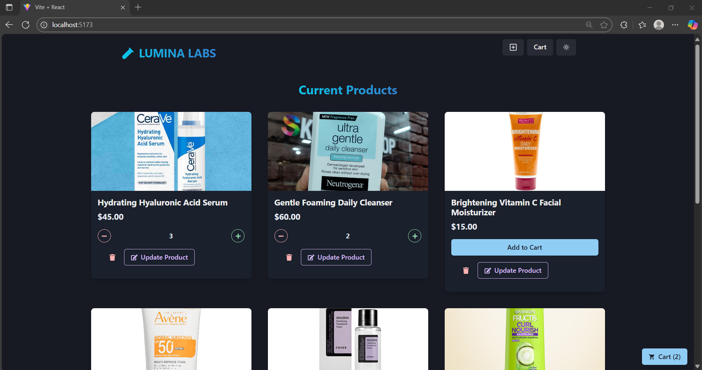
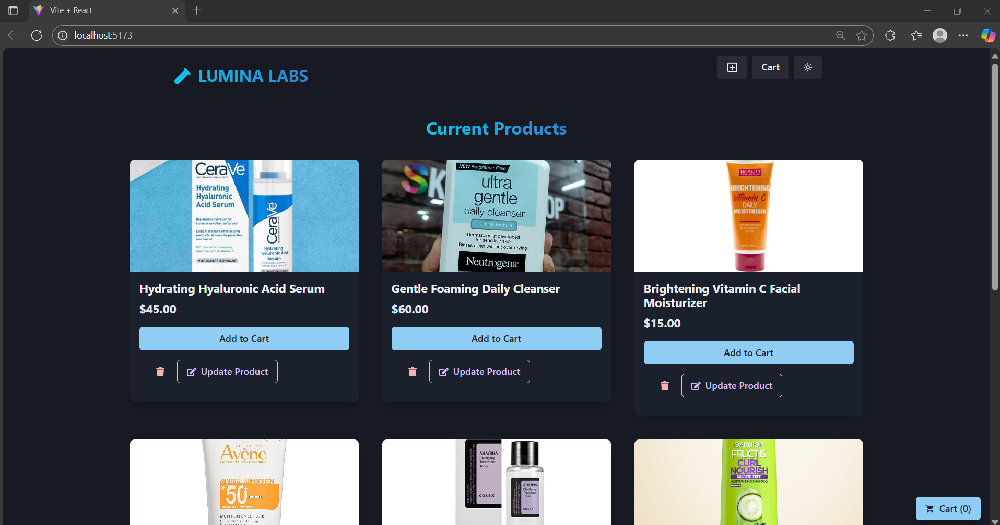
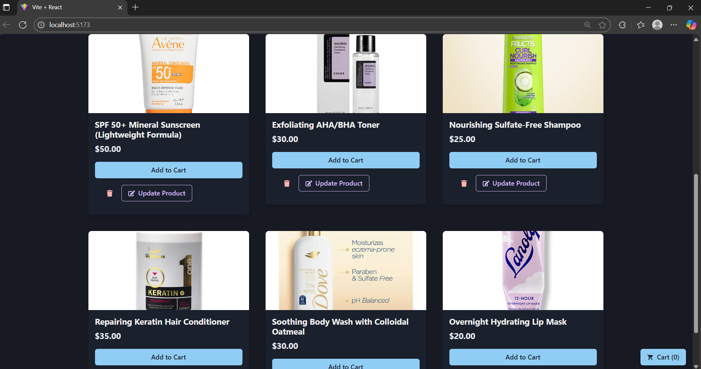
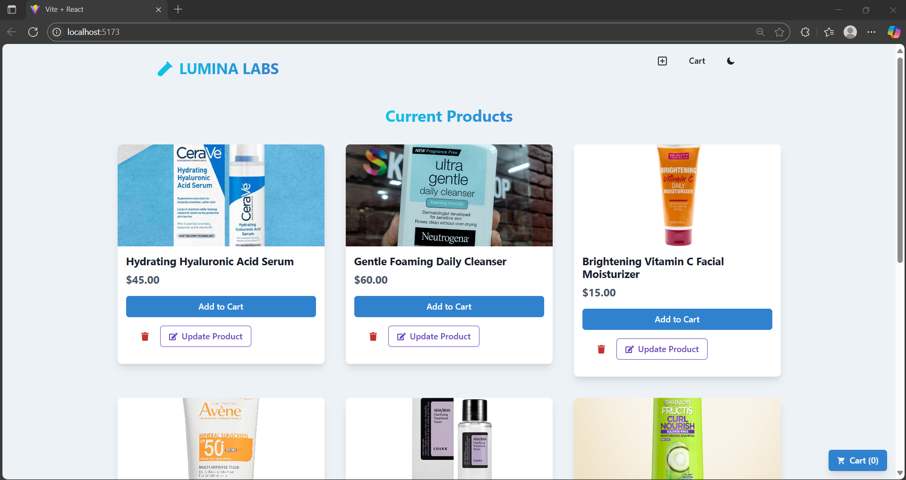
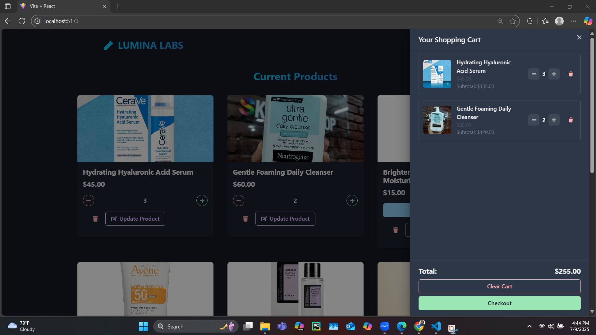
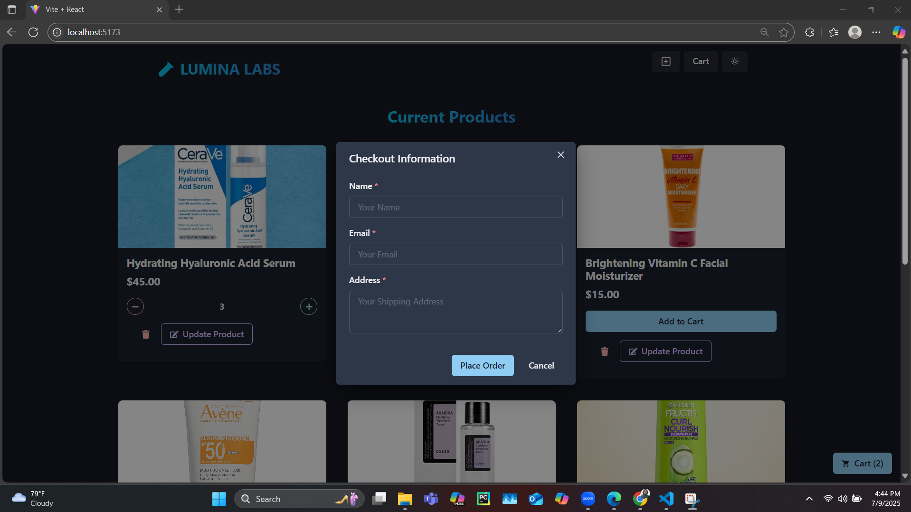
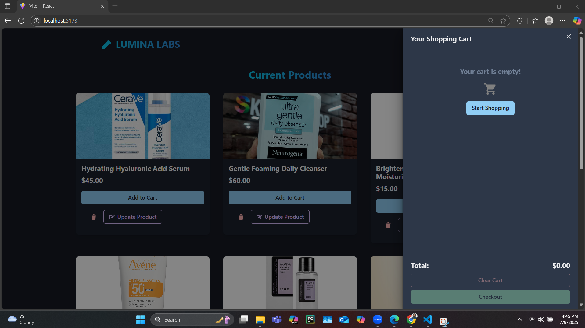
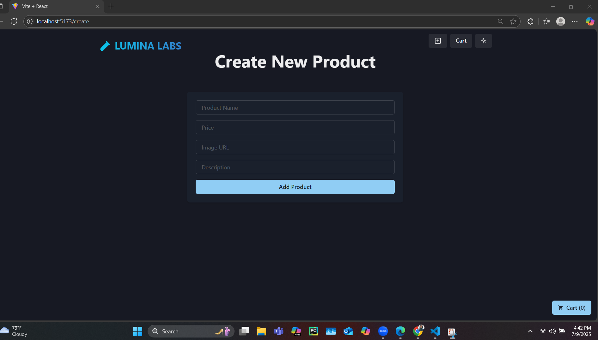
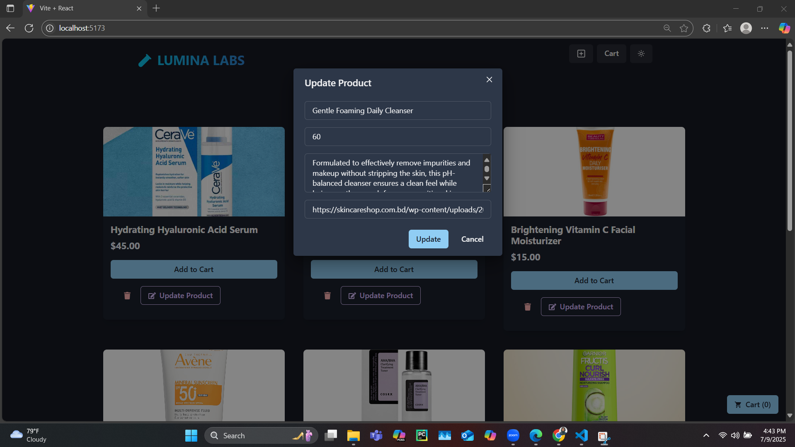

**Lumina Labs**

Welcome to Lumina Labs — A cutting-edge platform built with ReactJS, NodeJS, MongoDB, ExpressJS and more.

**Check out the live demo:** https://lumina-labs.vercel.app/

Link to the video demo: https://www.youtube.com/watch?v=EMuIWBUp0jU

**🛠 Tech Stack**
Frontend: ReactJS, Chakra UI, Zustand (for state management)

Backend: NodeJS, ExpressJS

Database: MongoDB

File Storage: Cloudinary

**🚀 Getting Started Locally**
To get your local copy of Lumina Labs up and running, follow the steps below:

1. Clone the Repository
Clone the repository to your local machine:

bash
Copy
Edit
git clone https://github.com/immza/Lumina-Labs.git
cd Lumina-Labs

2. Build the Project
Run the build command to prepare the application:

npm run build

2. Start the Project
Once the build completes, start the server with:

npm run start

Your project should now be running locally at http://localhost:5000

**Screenshots**

